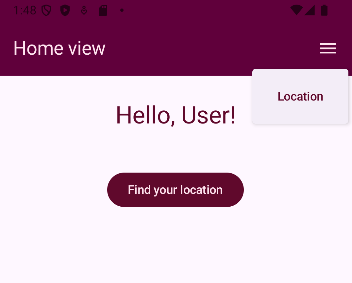
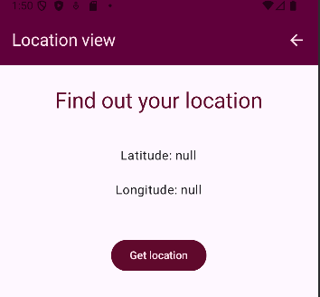
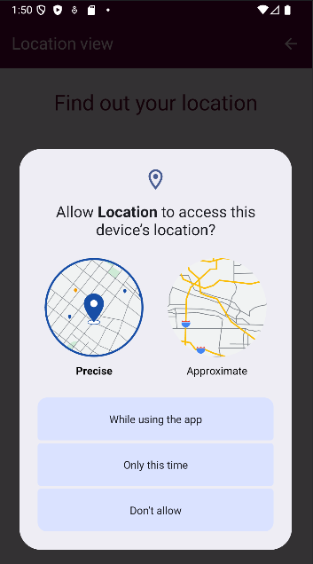
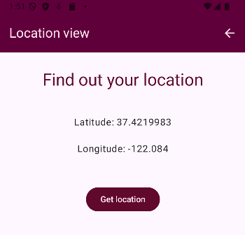

# Location 

This is a simple Android app that retrieves the device's GPS location and displays latitude and longitude. 
The app demonstrates **MVVM architecture** using **ViewModel** and **LiveData**, implemented in **Kotlin + Jetpack Compose**.

## Screenshots

<table>
    <tr>
        <td></td>
        <td></td>
    </tr>
    <tr>
        <td></td>
        <td></td>
    </tr>
</table>


## Features
- Home screen and location screen with TopBar navigation
- Home screen also includes button for redirection to location screen
- On location screen displays current latitude and longitude as decimal numbers after button press and permissions granted
- Requests runtime permission for location using `Accompanist Permissions`
-  "Get location" -button triggers permission request and updates coordinates
- Uses `ViewModel` and `LiveData` for state management

## Running the app
This project was created using Android Studio. To clone and run the project:

```bash
- git clone https://github.com/Anniina-55/Location.git 
- cd Location
- open project in Android Studio
- build and run on emulator or physical device